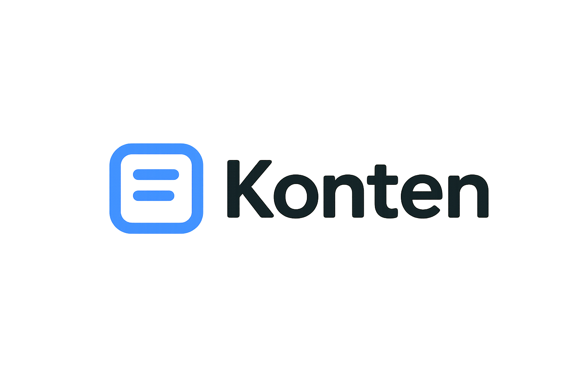

  

<h3 align="center">Open-source headless CMS, self-hosted or Cloud you’re in control.</h3>

The leading open-source headless CMS, 100% Java, flexible and fully customizable.

  <a href="https://cloud.konten.io/signups?source=github1">Cloud</a> · <a href="https://konten.io/demo">Try live demo</a>

 

Konten Community Edition is a free and open-source headless CMS enabling you to manage any content, anywhere.

- **Self-hosted or Cloud**: You can host and scale Konten projects the way you want. You can save time by deploying to [Konten Cloud](https://cloud.konten.io/signups?source=github1) or deploy to the hosting platform you want: **AWS, Azure, Google Cloud, DigitalOcean**.
- **Modern Admin Panel**: Elegant, entirely customizable and a fully extensible admin panel.
- **Multi-database support**: You can choose the database you prefer: PostgreSQL, MySQL, MariaDB, and SQLite.
- **Customizable**: You can quickly build your logic by fully customizing APIs, routes, or plugins to fit your needs perfectly.
- **Blazing Fast and Robust**: Built on top of Java, Konten delivers reliable and solid performance.
- **Front-end Agnostic**: Use any front-end framework (React, Next.js, Vue, Angular, etc.), mobile apps or even IoT.
- **Secure by default**: Reusable policies, CORS, CSP, P3P, Xframe, XSS, and more.
- **Powerful CLI**: Scaffold projects and APIs on the fly.

## Getting Started

<a href="https://docs.konten.io/developer-docs/latest/getting-started/quick-start.html" target="_blank">Read the Getting Started tutorial</a> or follow the steps below:

### ⏳ Installation

Install Konten with this **Quickstart** command to create a Konten project instantly:

> **TODO**

This command generates a brand new project with the default features (authentication, permissions, content management, content type builder & file upload).

Enjoy 🎉

## Features

- **Content Types Builder**: Build the most flexible publishing experience for your content managers.
- **Media Library**: Upload your images, videos, audio or documents to the media library. Easily find the right asset, edit and reuse it.
- **Internationalization**: The Internationalization (i18n) plugin allows Konten users to create, manage and distribute localized content in different languages, called "locales"
- **Role Based Access Control**: Create an unlimited number of custom roles and permissions for admin and end users.
- **GraphQL or REST**: Consume the API using REST or GraphQL

You can unlock additional features such as SSO, Audit Logs, Review Workflows in [Konten Cloud](https://cloud.konten.io/login?source=github1).

**[See more on our website](https://konten.io/overview)**.

## Try live demo

See for yourself what's under the hood by getting access to a [hosted Konten project](https://konten.io/demo) with sample data.

## License

See the [LICENSE](./LICENSE) file for licensing information.